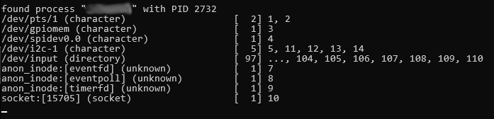

# File Descriptor Monitor - fdmonitor

> See also [TheoSignore/fdmonitor](https://github.com/TheoSignore/fdmonitor), which sadly didn't run on the platform I needed to monitor. So I made this most simple and basic file descriptor monitor.

#### Usage
`./fdmonitor (name | pid)`

#### Output:


---

# Build

```
$ g++ -std=c++17 -o fdmonitor main.cpp
```
